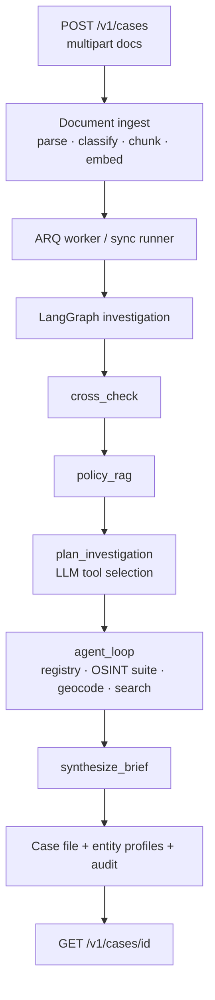

# Architecture

AI Underwriting Assistant — agentic **fraud investigation** pipeline for complex lending (SBA 7(a), CRE, specialty mortgage).

## Current product boundary

**In scope today**

- Unstructured document cross-check with cited contradictions
- Tenant policy RAG at investigation time
- Hybrid OSINT profiling → `CaseFile.entity_profiles` + advisory recommendation
- Immutable audit trail per case

**Out of scope today** (see [PRODUCT_ROADMAP.md](PRODUCT_ROADMAP.md))

- Financial statement spreading / DSCR engines
- Credit memo generation as a product surface
- LOS integrations (Encompass, nCino, etc.)
- Commercial KYC/OSINT vendor SDKs
- Enterprise SSO / per-tenant RBAC

Outputs are **advisory**. Humans decide approve / review / decline.

## Pipeline

## Components

| Layer | Path | Role |
|-------|------|------|
| API | `apps/api/` | FastAPI case + policy endpoints, API key auth |
| Worker | `apps/worker/` | ARQ `process_case` + LangGraph graph definition |
| Investigation | `packages/agent/` | Runner nodes, case file builder, tool registry |
| OSINT | `packages/osint/` | Hybrid providers, router, EntityProfile analyzer |
| Spreading | `packages/spreading/` | CSV/XLSX parse + variance vs stated metrics |
| Memo | `packages/memo/` | Jinja credit-memo drafts |
| LOS | `packages/los/` | HMAC webhooks, export, ingest |
| Auth | `packages/auth/` | API key + OIDC principals / RBAC |
| Cross-check | `packages/cross_check/` | Semantic + rule-based contradiction detection |
| Policy RAG | `packages/policy_rag/` | Tenant policy ingest/retrieve/evaluate |
| Documents | `packages/documents/` | Parse, PII redact, classify, chunk |
| LLM | `packages/llm/` | Ollama / Azure / heuristic fallback + embeddings |
| Verticals | `packages/verticals/` | SBA 7(a), CRE acquisition, bank-statement mortgage |
| Demo UI | `apps/demo-ui/` | React case list / upload / case file viewer |

## Investigation graph stages

1. **intake** — load case, document bundle, enrich metadata from text
2. **cross_check** — vertical narrative pairs → contradictions
3. **policy_rag** — retrieve policy chunks → compliance findings
4. **plan_investigation** — LLM selects follow-up tools (no re-run of steps 2–3)
5. **agent_loop** — execute tools within `MAX_AGENT_STEPS`, then fuse entity profiles
6. **synthesize_brief** — executive summary for human underwriter
7. **finalize** — persist case file, mark `completed`

## Advisory recommendations

- `approve` — no material contradictions; policies pass; OSINT not flagged
- `review` — high-severity contradiction, policy fail/review, or OSINT flagged/mismatch
- `decline` — multiple independent high-severity signals (still advisory; humans decide)

## OSINT suite (hybrid)

Investigation tools resolve via `OsintRouter` (`packages/osint/`). Default `OSINT_MODE=auto`: live when keys/cache available, else deterministic fixture corpus.

| Tool | Fixture | Live | Maturity |
|------|---------|------|----------|
| `lookup_business_registry` | `registry.json` | OpenCorporates (API key) | Live = demo/pilot; enterprise needs paid/contracted registry |
| `verify_employer_osint` | employers + mismatch pairs | Name heuristics | Fixture-grade for demos; not LinkedIn |
| `verify_web_presence` | `web.json` | RDAP + HTTP | Useful signal; not identity proof |
| `check_sanctions` | `sanctions.json` | OFAC SDN path or downloaded cache | Production-viable with cached SDN + legal review |
| `search_adverse_media` | `adverse_media.json` | NewsAPI (key + quota) | Pilot only; commercial media APIs for scale |
| `lookup_sec_filings` | `sec.json` | SEC EDGAR (User-Agent) | Good for public cos; private borrowers often empty |
| `geocode_address` / `address_risk_signals` | addresses + heuristics | Nominatim | Heuristic risk; respect Nominatim ToS/rate limits |

After the agent loop, `ProfileAnalyzer` always builds `CaseFile.entity_profiles` for business, employer, principal, and address.

Accuracy on the synthetic golden set: [OSINT_EVAL.md](OSINT_EVAL.md). Enterprise packaging: [ENTERPRISE.md](ENTERPRISE.md).
