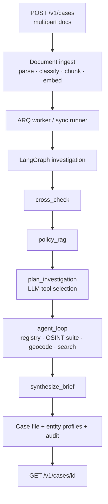

# Architecture

AI Underwriting Assistant — agentic fraud investigation pipeline.

## Pipeline

## Components

| Layer | Path | Role |
|-------|------|------|
| API | `apps/api/` | FastAPI case + policy endpoints, API key auth |
| Worker | `apps/worker/` | ARQ `process_case` + LangGraph graph definition |
| Investigation | `packages/agent/` | Runner nodes, case file builder, tool registry |
| OSINT | `packages/osint/` | Hybrid providers, router, EntityProfile analyzer |
| Cross-check | `packages/cross_check/` | Semantic + rule-based contradiction detection |
| Policy RAG | `packages/policy_rag/` | Tenant policy ingest/retrieve/evaluate |
| Documents | `packages/documents/` | Parse, PII redact, classify, chunk |
| LLM | `packages/llm/` | Ollama / Azure / heuristic fallback + embeddings |
| Verticals | `packages/verticals/` | SBA 7(a), CRE acquisition, bank-statement mortgage |
| Demo UI | `apps/demo-ui/` | React case list / upload / case file viewer |

## Investigation graph stages

1. **intake** — load case, document bundle, enrich metadata from text
2. **cross_check** — vertical narrative pairs → contradictions
3. **policy_rag** — retrieve policy chunks → compliance findings
4. **plan_investigation** — LLM selects follow-up tools (no re-run of steps 2–3)
5. **agent_loop** — execute tools within `MAX_AGENT_STEPS`
6. **synthesize_brief** — executive summary for human underwriter
7. **finalize** — persist case file, mark `completed`

## Advisory recommendations

- `approve` — no material contradictions; policies pass
- `review` — any high-severity contradiction or policy fail/review
- `decline` — multiple independent high-severity signals (still advisory; humans decide)

## OSINT suite (hybrid)

Investigation tools resolve via `OsintRouter` (`packages/osint/`):

| Tool | Fixture | Live (when configured) |
|------|---------|------------------------|
| `lookup_business_registry` | `data/fixtures/osint/registry.json` | OpenCorporates API |
| `verify_employer_osint` | employers corpus + mismatch pairs | name heuristics |
| `verify_web_presence` | web.json | RDAP + HTTP probe |
| `check_sanctions` | sanctions.json | local OFAC SDN path |
| `search_adverse_media` | adverse_media.json | NewsAPI |
| `lookup_sec_filings` | sec.json | SEC EDGAR tickers |
| `geocode_address` / `address_risk_signals` | addresses + heuristics | Nominatim |

After the agent loop, `ProfileAnalyzer` always builds `CaseFile.entity_profiles` for business, employer, principal, and address.
